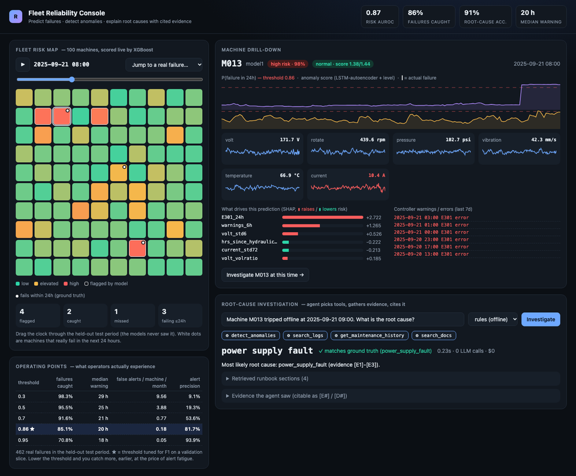
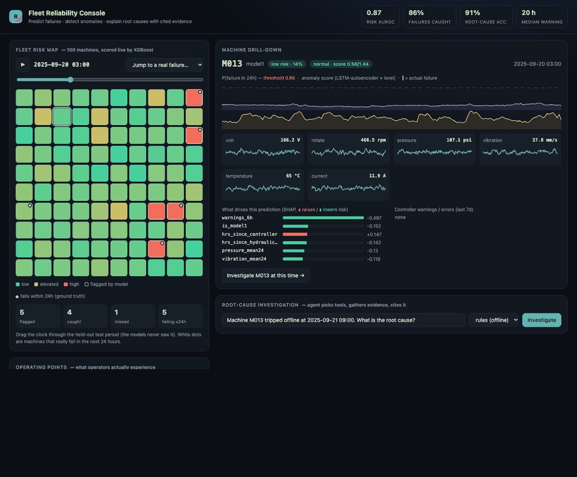
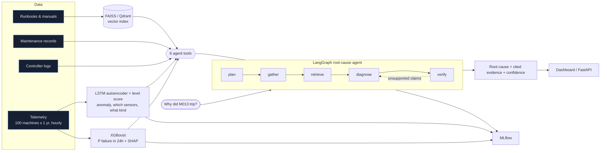

<div align="center">

# Predictive Failure & Root-Cause Agent

**Predict which machines will fail in the next 24 hours, then have an AI agent explain *why*, with cited evidence.**


[](https://github.com/aayshinde/failure-rca-agent/actions/workflows/ci.yml)




</div>

<p align="center"><b><a href="https://aayshinde.github.io/failure-rca-agent/">▶ Open the live interactive demo</a></b> (no install, no login; runs in your browser)<br>
<sub>Scrub the clock through the held-out test period, click any machine, and replay a real failure end to end.</sub></p>

<p align="center"></p>

> **In 30 seconds:** an early-warning system for factory machines. It warns maintenance teams about a day before a machine
> breaks, and when one does break, an AI assistant explains the most likely cause and shows the evidence it used.
> **Problem:** breakdowns are costly and the clues are spread across sensors, error logs and repair manuals.
> **Built:** models that watch 100 simulated machines, plus an AI agent that gathers the evidence and answers with citations.
> **Result:** 85% of failures caught with a median 20 h of notice and 0.18 false alerts per machine per month.

> **Or run it yourself in 3 commands, no API key and no cost:** `make setup && make data && make demo`, then open http://localhost:8000

## What makes it different

| | |
|---|---|
| **Live console, not just notebooks** | Scrub a clock through the held-out test period and watch 100 machines change colour as XGBoost re-scores them. White dots mark machines that *really* fail in the next 24h, so you can see hits and misses, not just a metric. |
| **Three signals, one diagnosis** | Telemetry (6 sensors, hourly), controller logs and maintenance documentation. No single source is enough: a classifier on logs alone reaches ~88%, telemetry alone ~78%, both ~95%. |
| **Explains itself** | Every prediction comes with SHAP drivers. Every diagnosis cites the evidence (`[E#]` tool output, `[D#]` runbook section) it was built from. |
| **Evaluated like a product** | 393 held-out questions: root-cause accuracy with bootstrap CIs, tool-selection accuracy, retrieval hit@k/MRR, LLM-judge groundedness, latency and cost per question. A baseline ReAct agent is compared with a LangGraph workflow. |
| **No leakage by construction** | Time-based split (train on the first 60% of the year, evaluate on the rest). The maintenance tool only returns records *before* the incident time, and there is a test for it. |
| **Runs free, offline, or on a local LLM** | `EMBED_MODEL=local` plus the deterministic `rules` agent run the whole stack with no network. `LLM_PROVIDER=ollama` runs the real LLM agents (and the groundedness judge) on a local model, so the full agent comparison costs $0. OpenAI is a one-line switch. |
| **Honest about what doesn't work** | Ablations, a linear baseline, a public-benchmark check where the linear model *ties* XGBoost, and an anomaly detector whose blind spots are measured, not hidden. |

## Architecture



## Results

Everything below is on the **held-out test period** (the last 40% of the simulated year; models never saw it), seed 7.
Reproduce each table with the command shown under it.

### 1. What an operator experiences (not just AUROC)

AUROC says little about whether a model is usable on a plant floor. Hourly risk scores become *alert episodes*, and the
question becomes: how early, and at what cost in false alarms? (462 real failures, 100 machines, ~4 months.)

| Threshold | Failures caught | Median warning | False alerts / machine / month | Alert precision |
|---|---|---|---|---|
| 0.50 | 95.5% | 25 h | 3.88 | 19% |
| **0.86 (tuned)** | **85.1%** | **20 h** | **0.18** | **82%** |
| 0.95 | 70.8% | 18 h | 0.05 | 94% |

At the tuned threshold a maintenance crew gets roughly a day of notice for 6 in 7 failures and chases a false alarm about
once per machine every 5 months. The full curve is in the dashboard. `make lead-time` ([src/lead_time.py](src/lead_time.py))

### 2. Is XGBoost earning its place, and which data source matters?

| Model (same split, same features) | AUROC | AUPRC | F1 |
|---|---|---|---|
| **XGBoost, all features** | **0.865** | **0.624** | **0.631** |
| Logistic regression, all features | 0.865 | 0.530 | 0.550 |
| XGBoost, logs only | 0.818 | 0.522 | 0.541 |
| XGBoost, telemetry only | 0.798 | 0.406 | 0.455 |
| XGBoost, maintenance records only | 0.534 | 0.034 | 0.045 |
| Heuristic: hours since last service | 0.449 | 0.028 | – |

- XGBoost ties logistic regression on AUROC but is clearly better where an operator feels it (AUPRC +0.09, F1 +0.08):
  the non-linear model ranks the *top* of the list better.
- Telemetry and logs are each informative and **complementary** (0.80 and 0.82 alone, 0.87 together).
- Maintenance-age features add nothing here (dropping them scores marginally higher, 0.870 vs 0.865 AUROC; one seed, so read it as "no help" rather than "harmful"), and the classic
  "service by the calendar" heuristic is no better than chance in this simulation. Worth knowing before building a
  maintenance-records pipeline. `python -m src.baselines` ([src/baselines.py](src/baselines.py))

### 3. Does the recipe work on data I did not write? NASA C-MAPSS turbofan

The fleet data is simulated, so the same approach (rolling-feature XGBoost, "fails within N cycles") is checked on
NASA's public benchmark, FD001: 80 training engines, 20 held-out engines, plus the official 100-engine test set.

| Model | Held-out engines AUROC / AUPRC | Official test AUROC |
|---|---|---|
| XGBoost, rolling features | 0.994 / 0.969 | 0.987 |
| Logistic regression, same features | 0.994 / 0.969 | 0.988 |
| Logistic regression, raw sensors only | 0.989 / 0.952 | 0.978 |
| Age only (cycle count) | 0.907 / 0.546 | 0.802 |

The approach transfers (AUROC 0.99). The honest takeaway is that on FD001 (one operating condition, smooth monotonic
wear) a linear model is just as good, so the benchmark validates the *pipeline* but cannot justify the *complexity*.
The fleet data, with its abrupt log-driven failures, is where the non-linear model pays off (table 2).
`make benchmark` ([src/benchmark_cmapss.py](src/benchmark_cmapss.py))

### 4. Anomaly detector

| | AUROC |
|---|---|
| LSTM autoencoder + level score (combined) | 0.75 |
| Autoencoder alone / level score alone | 0.61 / 0.70 |
| Sensor-malfunction mode (erratic readings) | 0.92 |
| Controller faults | 0.50 (by design: they leave no telemetry trace, only logs show them) |

The ablation is the point: a reconstruction model reproduces slow drifts well, so it misses bearing and hydraulic
degradation and excels at erratic sensors. The level score covers what the autoencoder cannot.

### 5. The agents: does the LangGraph workflow beat a plain ReAct loop?

Same six tools, same questions, same model: **Qwen2.5-7B-Instruct running locally via Ollama** (12k context, temperature 0,
$0). 32 held-out questions: 20 postmortems, 6 risk checks, 6 documentation lookups. Raw per-question results are in
[docs/results/](docs/results/).

| Metric | react (baseline) | **graph** (LangGraph) | rules (no LLM, 393 q) |
|---|---|---|---|
| Root-cause accuracy (20 postmortems) | 65% (CI 45 to 85) | **80%** (CI 60 to 95) | 91% |
| Tool-selection accuracy | 22% | **100%** | 100% |
| Doc retrieval hit@k | 27% | **92%** | 91% |
| Unsupported-response rate | 15.6% | **3.1%** | n/a |
| Mean groundedness | 90.6% | **96.3%** | n/a |
| Risk-question accuracy (6 q) | **100%** | 67% | 73% |
| Latency p50 / p95 | **60 s** / 355 s | 119 s / **235 s** | 0.03 s |

What the numbers do and do not say:

- **The structured workflow helps most where the design says it should.** It gathers evidence by a routing policy, builds
  the doc-search query from that evidence (error codes, abnormal sensors) instead of from the question, and verifies its
  own claims. Retrieval hit rate goes from 27% to 92%, and unsupported responses fall from 15.6% to 3.1%.
  Tool selection at 100% is largely true by construction (the policy picks the tools), so it is not an LLM achievement.
- **The accuracy gain is suggestive, not proven.** 80% vs 65% on 20 postmortems has overlapping 95% intervals.
- **`graph` is worse on risk questions** (4 of 6 vs 6 of 6): it called two machines that were about to fail "safe".
  With 6 questions this is anecdotal, but it is the first thing I would investigate. It is also weaker on
  `hydraulic_leak` (1 of 3).
- **`graph` is slower at the median** (119 s vs 60 s) because it makes an extra verification pass; its tail latency is better
  because the ReAct loop sometimes wanders.
- **Caveats:** one run, a small sample, a 7B model, and the groundedness judge is the *same* model that wrote the answers
  (self-judging flatters both agents). A stronger judge and a bigger sample are the obvious next step:
  `make eval-llm` is parameterised for it (`./run_llm_eval.sh 100 20 20`, plus a larger `CHAT_MODEL`).
- The `rules` agent was written knowing how the simulator works, so read its 91% as a ceiling for a rule-based system,
  not a fair competitor. It exists so the whole harness runs offline.

The run exposed two real failure modes of small local models, both now handled: a 7B model emitted `confidence: 100`
instead of `1.0` (schema now accepts percentages, with a test), and ReAct tool-call loops that exceed the context window
(the reason for the 12k-context model copy in [run_llm_eval.sh](run_llm_eval.sh)).

## Quick start

```bash
make setup          # venv + dependencies (copies .env.example to .env)
make data           # simulate fleet, train both models, index docs (~2 min, free)
make demo           # dashboard at http://localhost:8000   (API docs at /docs)
make test           # 13 offline tests
make eval           # offline evaluation report in results/report.md
make eval-llm       # react vs graph on a local Ollama model (free, ~2 h)
make lead-time      # warning time and false-alert burden
make benchmark      # NASA C-MAPSS check
```

Without `make`:

```bash
python -m venv .venv && source .venv/bin/activate && pip install -r requirements.txt
cp .env.example .env          # set EMBED_MODEL=local to avoid any OpenAI calls
python run_pipeline.py
uvicorn api:app --port 8000
```

macOS note: XGBoost needs `brew install libomp`.

**LLM agents, free (local):** install [Ollama](https://ollama.com), then `ollama pull qwen2.5:7b-instruct nomic-embed-text` and
run `make eval-llm` ([run_llm_eval.sh](run_llm_eval.sh)). For a single question:

```bash
LLM_PROVIDER=ollama CHAT_MODEL=qwen2.5:7b-instruct EMBED_MODEL=ollama:nomic-embed-text \
  python -m src.agent graph "Machine M013 tripped offline at 2025-09-21 09:00. What is the root cause?"
```

**LLM agents, OpenAI:** set `LLM_PROVIDER=openai` and a real `OPENAI_API_KEY` in `.env`. The dashboard then offers the
`graph` and `react` variants. Pick real machines and times from `data/incidents.csv` (rows with `split=test`).

Evaluation runs are resumable. Reproduce the extra analyses with `make lead-time`, `make benchmark` and `python -m src.baselines`.

MLflow: `mlflow ui --backend-store-uri sqlite:///mlflow.db` (http://localhost:5000).

## Data

The data is **simulated** (`src/simulate.py`), so ground-truth root causes are known — real plants rarely
label failures this cleanly. 100 machines of 4 models, one year, hourly:

| Source | Size | Content |
|---|---|---|
| Telemetry | ~863K rows | volt, rotate, pressure, vibration, temperature, current |
| Controller logs | ~130K events | error codes with background noise, shift events |
| Maintenance | ~2.1K records | scheduled service + corrective repairs per component |
| Incidents | ~1,160 failures | 7 failure modes with ground truth; ~470 in the held-out test period |
| Documentation | 13 docs / 73 chunks | runbooks, error-code reference, service manual, distractor docs |

Each failure mode leaves a precursor signature (sensor drift or instability, characteristic error codes).
What makes it hard: random signature strength, error codes shared between modes, background warning noise,
harmless transient disturbances, missing logs for 12% of incidents, operator notes that are usually generic
and sometimes misleading. Sanity check: a supervised classifier on the tool outputs reaches ~88% from logs only,
~78% from telemetry only and ~95% from both — so good diagnosis requires combining sources.

All splits are **time-based**: models train on the first 60% of the year; every evaluation question comes from
the last 40%. The maintenance tool only returns records *before* the incident time (tested), so nothing leaks.

## Predictive models

| Model | What it does | Test result (seed 7) |
|---|---|---|
| XGBoost (`src/train_risk.py`) | P(failure within 24h) from 59 rolling telemetry, log-count and time-since-service features; threshold tuned for F1 on a validation slice | AUROC 0.87, F1 0.63, 84% of test failures flagged within 24h |
| PyTorch LSTM autoencoder + level score (`src/anomaly.py`) | Reconstruction error catches volatility/pattern anomalies; robust level deviation catches slow drifts | AUROC 0.75 combined (autoencoder alone 0.61, level alone 0.70) |

The ablation is deliberate: reconstruction models reproduce slow level drifts well, so the autoencoder alone
misses bearing/hydraulic drifts but excels at erratic sensors (AUROC 0.92 on sensor faults). Controller faults
leave no telemetry trace (AUROC ≈ 0.50 by design) — only the logs reveal them.

## The agent

Six tools (`src/tools.py`): `query_telemetry`, `detect_anomalies`, `predict_failure_risk`, `search_logs`,
`get_maintenance_history`, `search_docs`.

| | `react` (v1 baseline) | `graph` (v2, served by the API) |
|---|---|---|
| Control flow | generic ReAct loop, LLM picks tools + arguments freely | explicit LangGraph: plan → gather → retrieve → diagnose → verify |
| Tool selection | implicit | structured plan with question typing and a tool-routing policy |
| Doc retrieval | query written by the LLM | query built from the evidence (error codes, abnormal sensors) |
| Output | free text, root cause extracted afterwards | structured, root cause constrained to known modes, every claim cites `[E#]`/`[D#]` |
| Grounding | none | self-verification; unsupported claims are sent back for one revision |

`rules` is a deterministic, no-LLM reference: hand-written scoring rules. Because those rules were written with
knowledge of how the simulator works, treat its accuracy as a rough ceiling, not a fair competitor. Its main
job is letting the whole harness run offline.

## Evaluation (`src/evaluate.py`)

393 held-out questions by default: **300 postmortems** (real test-period incidents), 60 risk assessments
(half shortly before a failure, half far from any), 33 documentation lookups.

| Metric | Definition |
|---|---|
| Root-cause accuracy | predicted failure mode = ground truth (postmortems), with 95% bootstrap CI, per-mode breakdown and confusion matrix |
| Risk accuracy | "will fail in 24h" = ground truth |
| Tool-selection accuracy | required tools ⊆ tools used ⊆ required ∪ optional (per question type), plus precision/recall |
| Retrieval relevance | hit@k and MRR against the gold runbook / doc section |
| Groundedness | an LLM judge splits the answer into claims and checks each against the evidence the agent actually saw; *unsupported response* = < 80% of claims supported |
| Latency, cost | p50/p95 seconds; tokens and USD per question from the OpenAI usage metadata |

Outputs: `results/report.md`, `results/agent_eval_summary.json`, per-question JSONL (including every claim
verdict), confusion matrices, and an MLflow run per variant.

## Configuration (`.env`)

| Variable | Default | |
|---|---|---|
| `CHAT_MODEL` / `JUDGE_MODEL` | `gpt-4o-mini` | judge ideally stronger than the agent model |
| `EMBED_MODEL` | `text-embedding-3-small` | `local` = offline hashing embedder |
| `VECTOR_BACKEND` | `faiss` | `qdrant` uses embedded local Qdrant, or a server if `QDRANT_URL` is set |
| `N_MACHINES`, `N_DAYS`, `SEED` | 100, 365, 7 | simulation size |
| `GROUNDED_THRESHOLD` | 0.8 | |

After changing `EMBED_MODEL` or `VECTOR_BACKEND`, rebuild the index: `python -m src.retrieval build`.
Token prices live in `src/config.py` (`PRICES`) — check them against current OpenAI pricing.

## Docker

```bash
python run_pipeline.py          # on the host first: creates data/, models/
docker compose up --build       # API :8000 (using a Qdrant server), Qdrant :6333, MLflow UI :5000
```

## Project layout

```
src/knowledge.py      sensors, failure modes, signatures, error codes (single source of truth)
src/simulate.py       fleet simulator -> data/
src/docs_gen.py       maintenance documentation corpus + chunking
src/eval_set.py       held-out questions + tool policy (required/optional tools)
src/features.py       data access + feature engineering shared by training and tools
src/train_risk.py     XGBoost failure-risk model (MLflow)
src/anomaly.py        LSTM autoencoder + combined detector
src/train_anomaly.py  anomaly training/calibration/evaluation (MLflow)
src/retrieval.py      FAISS / Qdrant doc index
src/tools.py          the six agent tools
src/agent.py          LangGraph agents: react baseline, graph workflow, rules reference
src/llm.py            chat model + token/cost tracking callback
src/evaluate.py       evaluation harness + report + MLflow
api.py                FastAPI service + serves the dashboard
src/baselines.py      ablations + linear baseline for the risk model
src/lead_time.py      alert episodes: warning time and false-alert burden
src/benchmark_cmapss.py  public-benchmark check on NASA C-MAPSS
deploy/huggingface/   free live-demo deployment (Docker Space)
src/export_static.py  pre-computes the serverless GitHub Pages demo (docs/)
src/viz.py            data shaping for the dashboard (fleet snapshot, machine drill-down)
dashboard/index.html  single-file console, hand-written SVG charts, zero JS dependencies
run_pipeline.py       runs all offline steps
tests/                offline end-to-end tests (scripted fake LLMs)
```

## Limitations

- Simulated data: patterns are cleaner than a real plant's. The simulator is the place to make it harder
  (`src/simulate.py` constants at the top).
- LLM-as-judge groundedness is itself a model output; spot-check claims in the JSONL files.
- 300 postmortems gives roughly ±4–5 points of sampling error on accuracy (the report prints the CI).
- The Docker setup is provided but was not exercised in CI.
